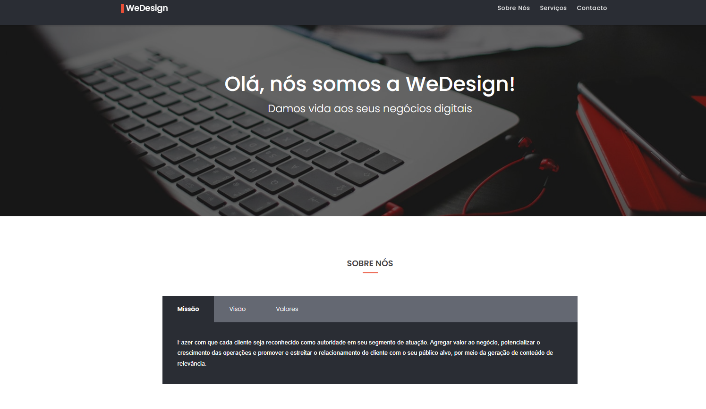
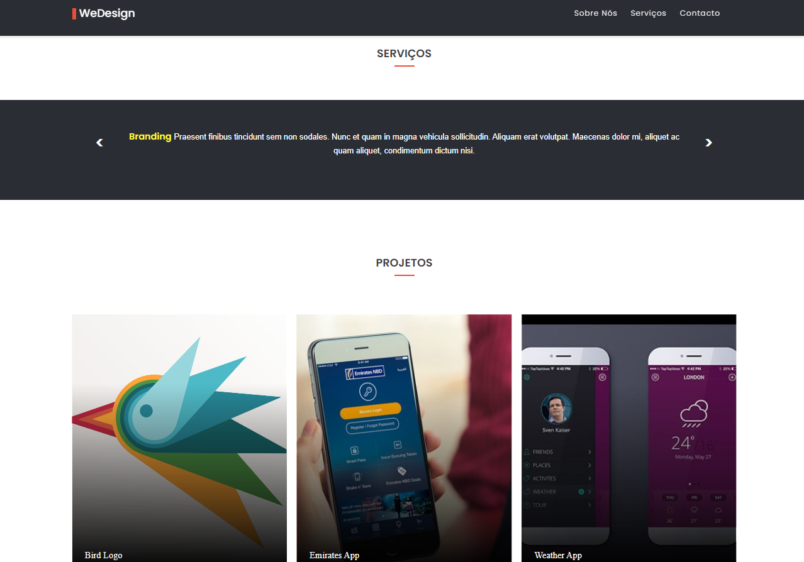
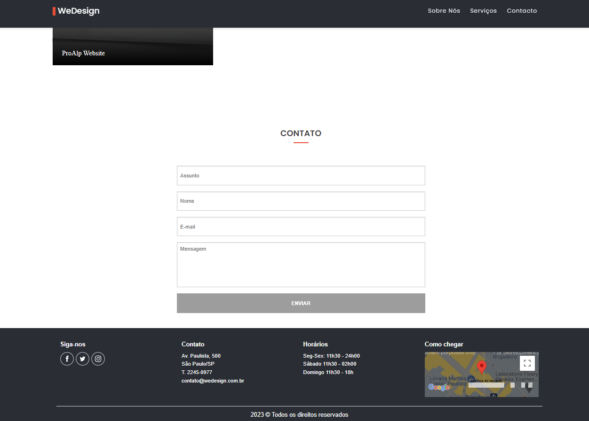

## Responsive-website

### 📄 Descrição:

Site responsivo de 3 páginas feito com JavaScript assíncrono, HTML e SCSS.

##

### 💻 Layout:

- primeira página -> fala sobre a empresa:
<h1>
  
</h1>
 

- segunda página -> fala sobre os serviços oferecidos e mostra alguns projetos:
<h1>
  
</h1>
 

- terceira página -> fornece os meios de contatos, horários de atendimento e o endereço:
<h1>
  
</h1>

- layout do site em um dispositivo móvel:
<h1>
  
</h1>

### 📍 Autora:

- NATHÁLIA MIRIAM
- LinkedIn: https://www.linkedin.com/in/nathaliamiriam/
- Portfólio: https://nathaliamiriam.github.io/
